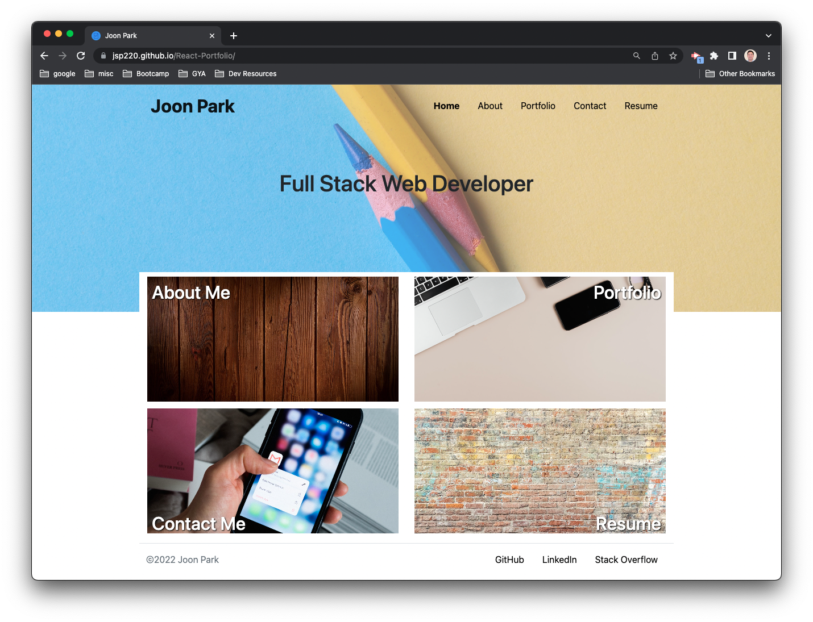
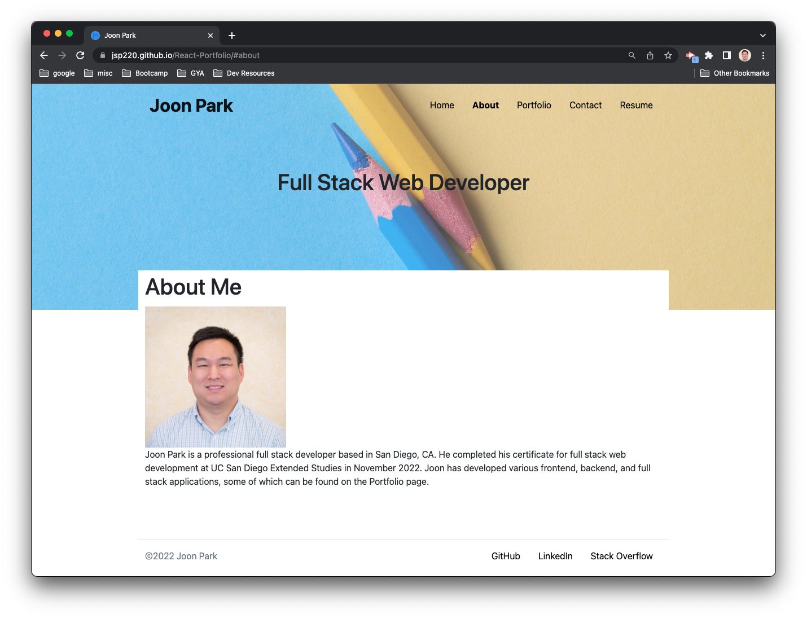
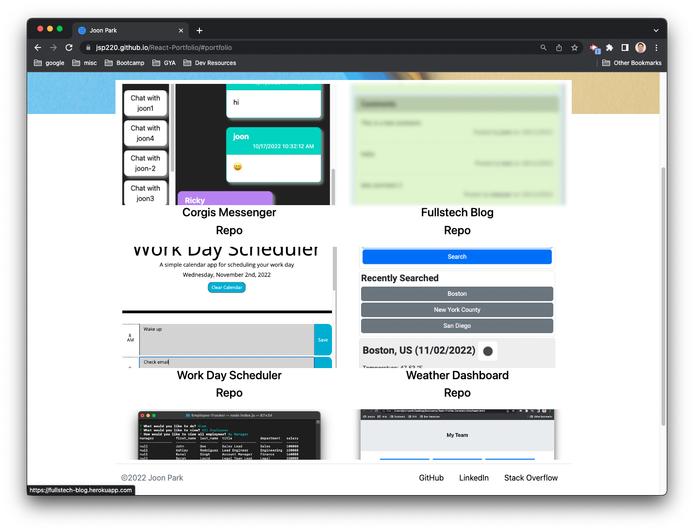
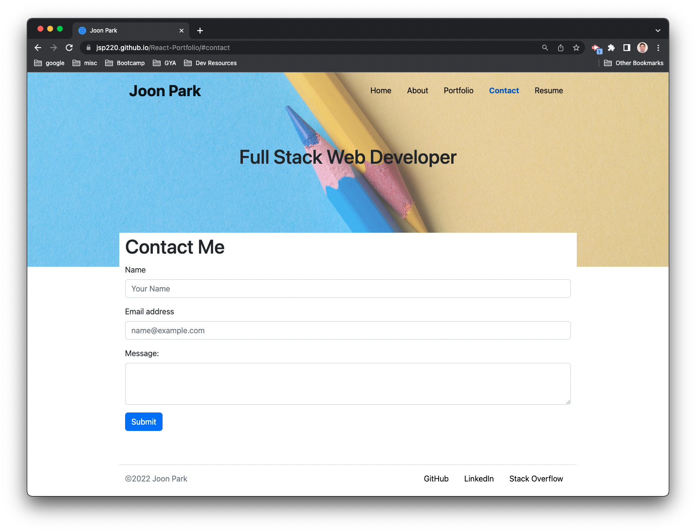
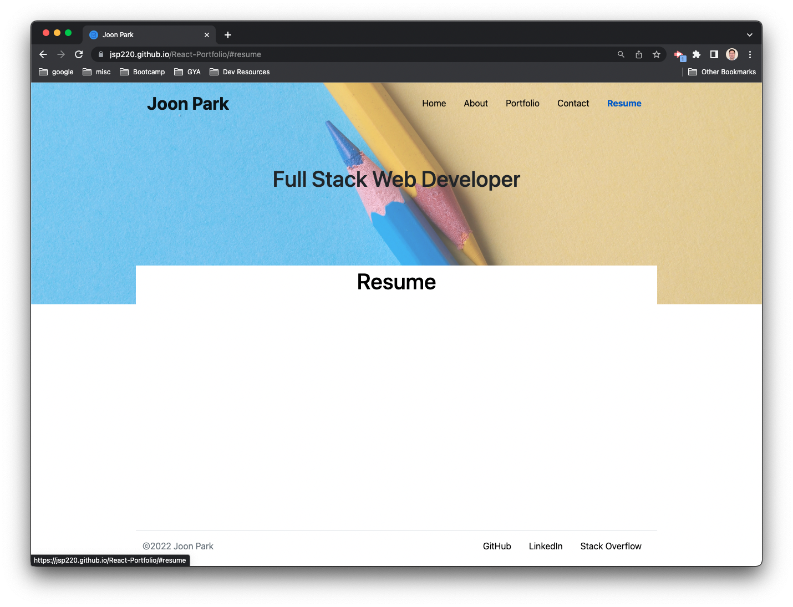

# React-Portfolio

## Description

My personal portfolio built with React.

## Usage

The deployed page can be found at:

[Joon Park Portfolio](https://jsp220.github.io/React-Portfolio/)

The home page shows visuals for each available page.

The About Me page contains a short introduction.

The Portfolio page contains 6 of my recent web development projects.

The Contact Me page contains a form to send me a message.

The Resume page contains a link to a recent version of my resume.

## License

Licensed under the MIT license.